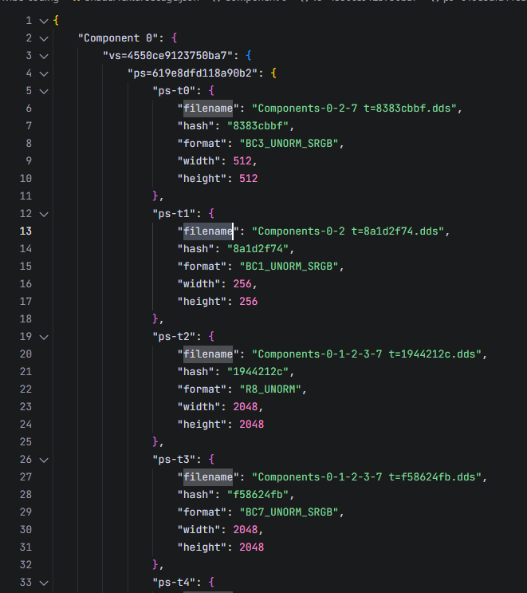
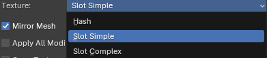
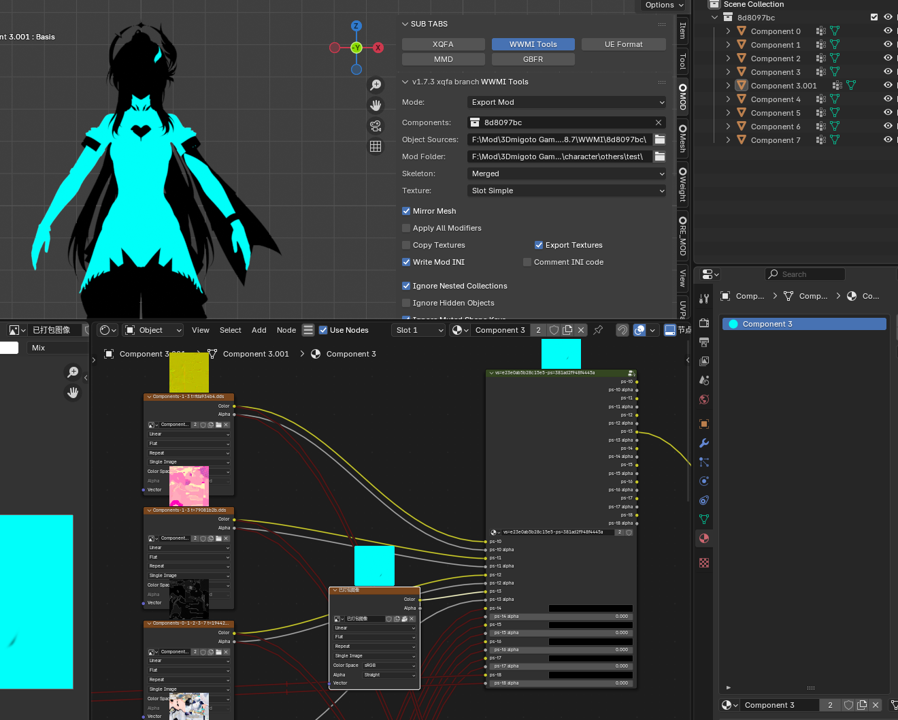
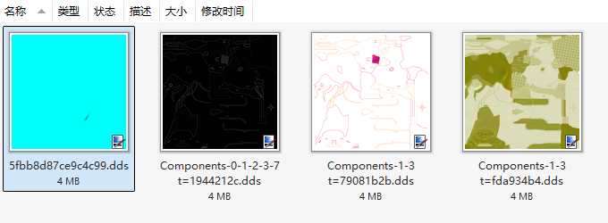
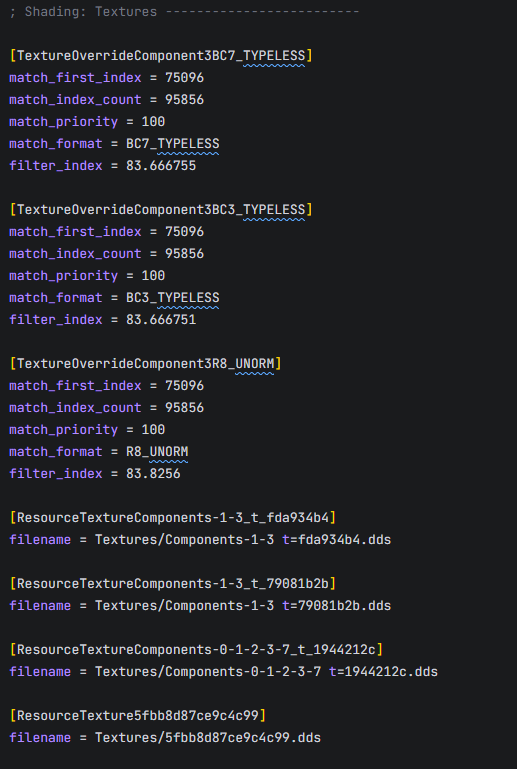
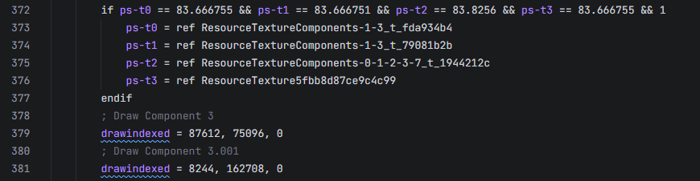
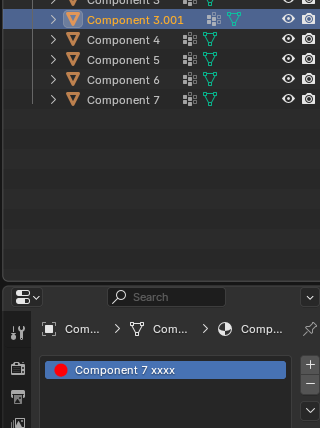
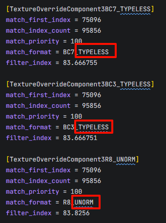
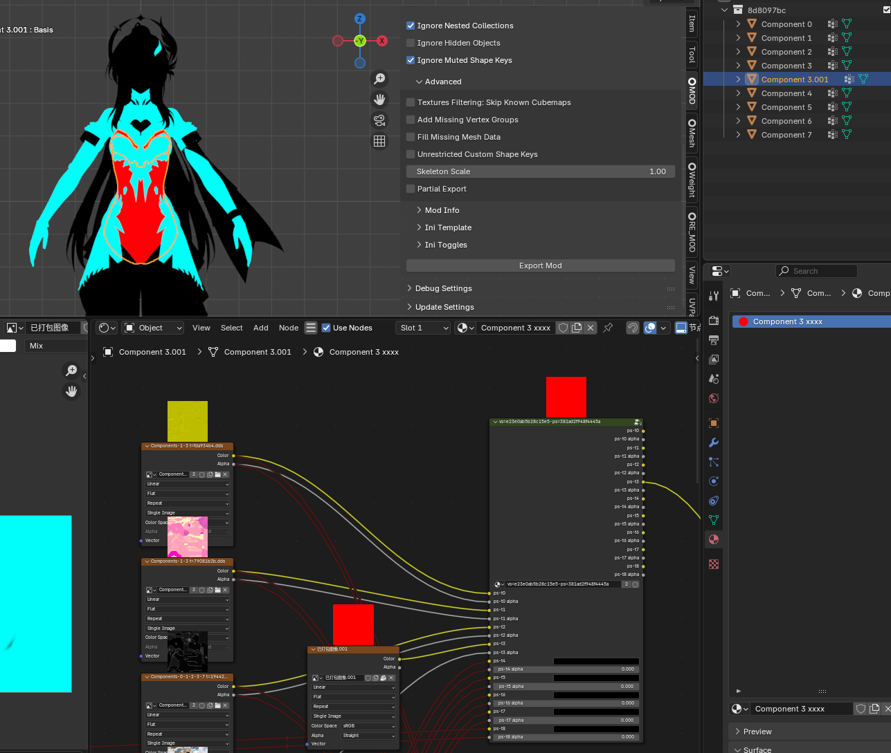

# Texture slot mode
这个分支版本主要增加Texture的slot模式

根据每个着色器的slot各部位dds格式的不同，过滤出正确的着色器

## Extract Objects From Dump

会增加一个ShaderTextureUsage.json文件

## Import Object

当选择Slot Simple或Slot Complex时

将导入ShaderTextureUsage.json作为材质
这些材质默认都是禁用的

## Export Mod

导出时将只对已激活的vs=ps=的节点组和上面已激活的输入进行导出

使用M键激活节点组，使用ctrl alt 右键激活连线

将图片连接到需要的ps-t slot上。不要连接到ps-t alpha，那不会被插件处理

导出图片Export Textures时，如果图片在ObjectSources中，会复制
如果不是，会保存为副本为tga，并使用texconv.exe转化为dds格式，dds格式由ShaderTextureUsage.json中对应位置控制

Export Textures并不影响Copy Textures功能，但我还是建议把Copy Textures关闭

Export Mod后，在Textures中，会看到导出的图片，如果图片名称不是英文，会转化

## 注意
材质名应当和物体名的Component序号一致，比如这样就是不对的

不要修改vs=ps节点组的名称，因为要去ShaderTextureUsage.json中查找

大部分dds格式都是其对应的TYPELESS，除非它被其他mod截取
但是少部分dds格式不是这样，比如R8，如果你发现有其他奇怪的格式需要特殊处理，请告诉我

应该使用适当的slot来保证稳定性

1. 确保你选择的几个slot所在的着色器能够和其他着色器区分开，即这个dds format组合是唯一的
2. 不要选择那些不会被使用到的贴图，比如body的贴图在head上，它就不应该被选择
3. 一些同样作用的着色器可能存在略微的差别，比如在角色出现的瞬间的着色器和正常情况的着色器，可能在某一个slot位置插入的其他贴图

就像这样

| ps-t0 | ps-t1 | ps-t2 | ps-t3 | ps-t4 | ps-t5 | ps-t6 | ps-t7 |
| --- | --- | --- | --- | --- | --- | --- | --- |
| A | B | C | D | E | F | G | H |

| ps-t0 | ps-t1 | ps-t2 | ps-t3 | ps-t4 | ps-t5 | ps-t6 | ps-t7 | ps-t8 |
| --- | --- | --- | --- | --- | --- | --- | --- | --- |
| A | B | C | D | insert | E | F | G | H |

## “Slot Simple“ VS “Slot Complex“

大多数情况下使用Slot Simple是足够使用的

Slot Simple只会选择同个Component序号的第一个材质

Slot Complex则会分开，同时它兼容ini toggles的功能

Slot Complex会有多次绘制的风险，在首次draw之后，接下来的draw slot判断会受到上一次影响，此时那个slot 贴图的格式就是上一次所赋予的，如果导出后又将贴图保存为其他格式，那就导致判断错误。这种情况很少很少，在选择 手动备份资源然后还原资源 和 保存正确的格式，显然是后者更方便

